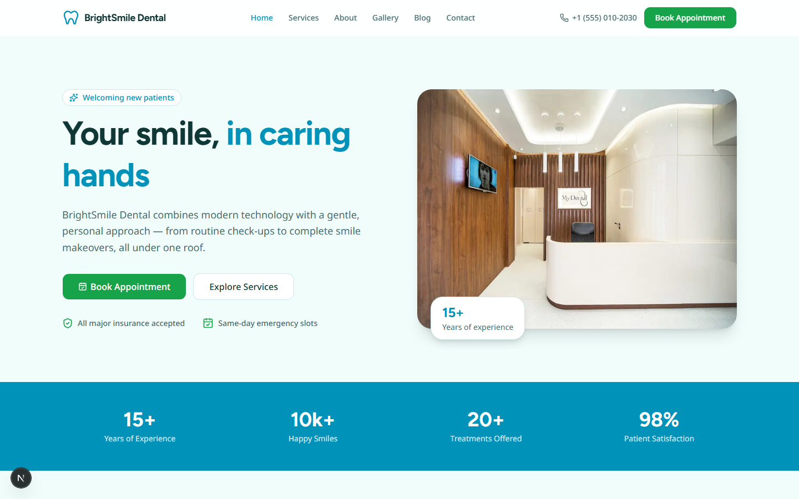
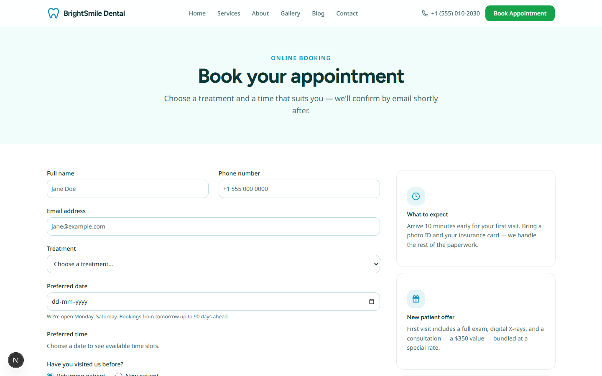
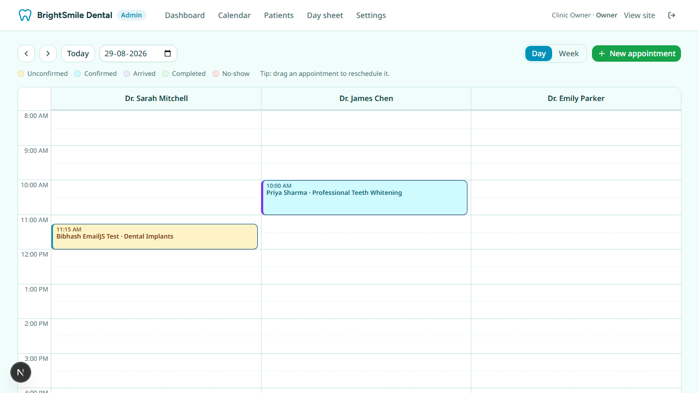
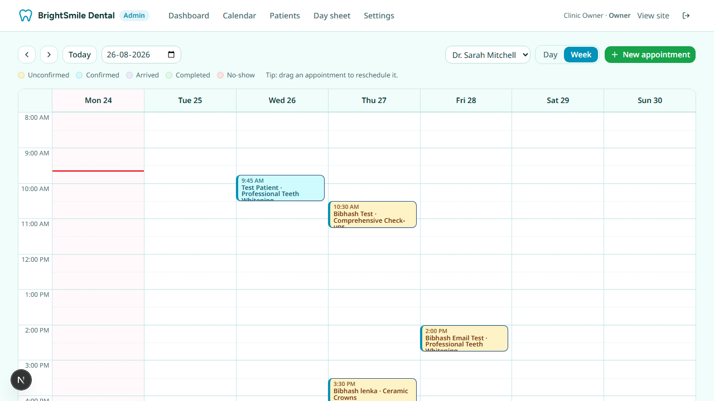
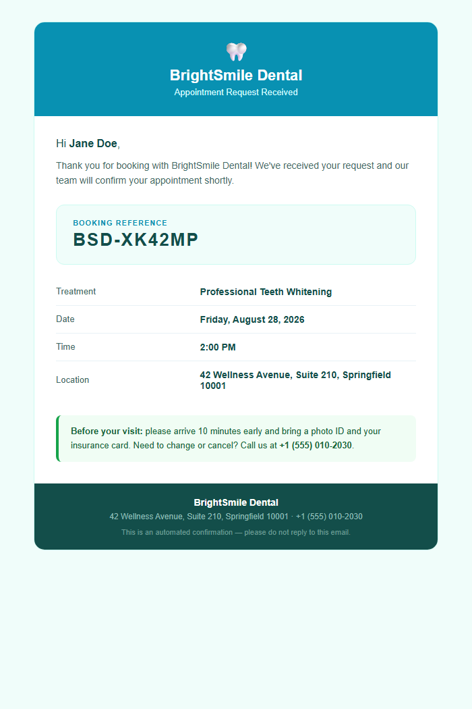

# BrightSmile Dental — Clinic Website & Practice Management Demo

A complete, fully functional dental clinic platform: a modern marketing website, a real
online booking system with live availability, a patient portal with digital intake forms
and moderated reviews, and a practice-management admin panel with a drag-and-drop
calendar, patient records, reporting, and staff roles.



## Tech stack

| Layer | Choice |
|---|---|
| Framework | **Next.js 16** (App Router, Server Components, Turbopack) + **TypeScript** |
| Styling | **Tailwind CSS v4** + **shadcn/ui** (Base UI) + **Framer Motion** |
| Database | **Prisma 7** + **SQLite** via `better-sqlite3` adapter (swap to Postgres by changing the adapter) |
| Calendar | **react-big-calendar** with drag-and-drop rescheduling |
| Forms | **react-hook-form + zod** — shared client/server validation |
| Email | **EmailJS** (sends via your own connected Gmail to any recipient), **Resend** fallback, console fallback with zero config |
| Icons / fonts | lucide-react · Figtree + Noto Sans via `next/font` |

## Getting started

```bash
npm install                 # also runs prisma generate (postinstall)
npx prisma db push          # creates prisma/dev.db from the schema
npx tsx prisma/seed.ts      # seeds 20 treatments, 3 dentists, staff accounts, booking rules
cp .env.example .env        # then fill in values (email is optional — see below)
npm run dev                 # http://localhost:3000
```

Production build: `npm run build && npm start`

### Trying the patient flows locally

Tokenised links normally arrive by email. To open them directly (note the
`--env-file` — without it the tokens are signed with the wrong secret):

```bash
npx tsx --env-file=.env scripts/phase3-links.ts          # intake / manage / review links
npx tsx --env-file=.env scripts/portal-link.ts you@example.com   # portal magic link
npx tsx --env-file=.env scripts/recall-fixture.ts        # a patient overdue for recall
npx tsx --env-file=.env scripts/phase3-state.ts          # dump reviews/intake/waitlist
```

## Features

### Public website
- Home, About, Contact, Smile Gallery (lightbox), Blog (4 articles)
- **Services**: 20 treatments across 9 filterable categories, each with its own detail page
- **Pricing** (`/pricing`): published starting price for every treatment, straight from the
  database, plus a monthly-payment calculator and the in-house membership plan
- **Reviews** (`/reviews`): moderated patient reviews with a rating breakdown, clinic
  replies, and `AggregateRating` + `Review` JSON-LD so stars can show in search results
- SEO: per-page metadata, `sitemap.xml`, `robots.txt`, `Dentist` JSON-LD schema
- Accessibility: skip link, aria states, focus rings, reduced-motion support, 44px touch targets

### Online booking (`/book`)
- Choose treatment → dentist (or "any available" — auto-assigns the least-busy) → date →
  **live availability** computed from the scheduling engine
- Per-treatment durations, transactional double-booking prevention, booking reference
- Branded confirmation email (see `emailjs-template.html`)



### Patient self-service (no login needed)
Every confirmation and reminder email carries a signed **manage link** where the
patient can:
- **Confirm** the appointment with one click
- **Reschedule** to any available slot (reminders reset automatically)
- **Cancel** (slot is released instantly)
- **Add to calendar** (.ics download with a 2-hour alarm)

### Patient portal (`/portal`)
Passwordless sign-in: enter your email, get a single-use magic link (hashed at rest,
20-minute expiry), and land on your own dashboard — upcoming appointments with manage
links, outstanding forms, full visit history, and a rating link for completed visits.

### Digital intake forms (`/intake/[token]`)
New patients get a secure link with their confirmation email and complete a mobile-first
medical history before arriving: conditions, medications, allergies, dental history,
insurance and a typed signature. Staff see the answers on the patient record with
allergies and medical flags called out, and the day sheet marks who still owes a form.

### Cancellation waitlist (`/waitlist`)
Patients register the treatment, dentist, date window and time of day that would work.
When an appointment is cancelled — by staff or by the patient — the freed day is
re-checked against the scheduling engine and matching people are emailed automatically
(up to three per opening, oldest first).

### Automated communication (`src/lib/jobs.ts`)
An idempotent job processor runs every 10 minutes in-process (see
`src/instrumentation.ts`) and via `/api/cron` for external schedulers
(`vercel.json` included):
- **Reminders** 72h and 24h before each appointment, with a one-click confirm button
- **Staff alert** to `CLINIC_NOTIFY_EMAIL` on every new online booking
- **Daily digest** of today's schedule to the clinic each morning
- **Review requests** ~2h after completed visits (enable with `GOOGLE_REVIEW_URL`)

### Scheduling engine (all DB-driven, editable in the admin UI)
- Per-dentist weekly working hours
- Per-treatment durations and prices
- Closed dates / holidays and time-off blocks (per dentist or whole clinic)
- Slot interval, buffer time between appointments, minimum notice, max advance window

### Admin panel (`/admin`)
- **Calendar** — day view with a column per dentist, week view per dentist,
  color-coded status, availability shading, and **drag-and-drop rescheduling**
  (server re-validates every move)
- **Walk-in / phone booking** from the calendar with existing-patient typeahead and a
  "squeeze in" override for out-of-hours bookings
- **Status lifecycle**: unconfirmed → confirmed → arrived → completed / cancelled / no-show
- **Patients** — records auto-created from bookings: visit history, notes, no-show count, search
- **Follow-ups** — no-shows and cancellations who never rebooked, in one chase list
- **Recall** — patients whose last visit was over six months ago with nothing booked,
  with a one-click "send recall" email and an opt-out; contacted patients drop off for 60 days
- **Waitlist** — everyone waiting for an earlier slot, with their window and preferences
- **Reviews** — moderation queue: publish, unpublish, feature on the home page, reply publicly
- **Reports** — any date range: bookings, estimated revenue from completed visits, no-show
  rate, new patients, per-dentist and per-treatment breakdowns, plus **CSV export** of
  appointments, patients and reviews
- **Day sheet** — printable daily schedule for the front desk, with intake-form status
- **Settings** — booking rules, treatments & pricing, working hours, closed dates, time blocks, staff accounts
- **Audit log** — who changed what, when (patient self-service actions included)




## Admin access

`/admin` redirects to `/admin/login`. Seeded demo staff accounts:

| Account | Password | Role |
|---|---|---|
| `owner@brightsmile.demo` | `admin123` | **Owner** — everything incl. settings, staff, audit log |
| `desk@brightsmile.demo` | `desk123` | **Receptionist** — calendar, patients, bookings, blocks |
| `dr.mitchell@brightsmile.demo` | `dentist123` | **Dentist** — schedule access |

Re-running `npx tsx prisma/seed.ts` is idempotent (safe to repeat).

## Environment variables

Copy `.env.example` to `.env`. The app runs with no email configuration
(confirmations are logged to the server console). For real emails:

### EmailJS setup (preferred)

1. Sign up at [emailjs.com](https://www.emailjs.com) → add an **Email Service**
   connected to your Gmail → copy the **Service ID**.
2. Create an **Email Template** → paste the contents of
   [`emailjs-template.html`](emailjs-template.html) into its code editor, and set:
   - **To Email**: `{{to_email}}`
   - **Subject**: `Appointment request received — {{reference}}`
3. In **Account → General**: copy the **Public Key** and **Private Key**, and enable
   **"Allow EmailJS API for non-browser applications"** (this app sends server-side,
   so keys never reach the browser).
4. Create a **second template** for reminders/notifications: its body is just the
   single line from [`emailjs-generic-template.html`](emailjs-generic-template.html)
   (`{{{message_html}}}`), To = `{{to_email}}`, Subject = `{{subject}}` — put its id
   in `EMAILJS_TEMPLATE_ID_GENERIC`.
5. Fill the `EMAILJS_*` values in `.env` and restart.

Emails then deliver through your own Gmail to any patient address:



### Resend (fallback)

Set `RESEND_API_KEY` — without a verified domain, Resend only delivers to your own
account email from `onboarding@resend.dev`.

## Project structure

```
src/
  app/(site)/          public pages (home, services, pricing, reviews, gallery, blog,
                       contact, book, waitlist, portal, intake/[token], review/[token])
  app/admin/           dashboard, calendar, patients, follow-ups, recall, waitlist,
                       reviews, reports (+ CSV export route), day-sheet, settings, login
  components/
    sections/          home-page sections (hero, stats, testimonials, FAQ, …)
    booking/           public booking form + waitlist form
    intake/            new-patient medical history form
    portal/            magic-link sign-in
    reviews/           star rating, review submission form
    pricing/           financing calculator
    admin/             calendar view, modals, settings panels, patient detail, moderation
    ui/                shadcn/ui primitives
  data/                marketing content (services copy, team, FAQs, blog, intake fields)
  lib/
    availability.ts    the scheduling engine (slots from hours/durations/blocks/closures)
    jobs.ts            reminders, review requests, daily digest (idempotent)
    waitlist.ts        matches freed slots to waiting patients
    recall.ts          who is overdue for a check-up
    portal.ts          patient magic links + portal session
    manage-token.ts    purpose-scoped HMAC links (manage / intake / review)
    actions/           server actions: booking, contact, admin, manage, portal,
                       intake, reviews, waitlist
    auth.ts + proxy.ts staff sessions (HMAC cookie) + /admin route guard
prisma/                schema, seed script, SQLite database (gitignored)
scripts/               dev utilities (check-db, phase3-links, portal-link, fixtures)
```

## Production notes

Before deploying for a real clinic:
- Swap SQLite for Postgres/Turso (Prisma adapter change) — required on serverless hosts
- Rotate `AUTH_SECRET`, all email keys, and every seeded password
- Add rate limiting to the public forms, plus privacy/terms pages
- Intake forms hold health information — review your jurisdiction's requirements
  (HIPAA/GDPR) before going live, and set a retention policy
- Error monitoring (Sentry) and scheduled database backups

> This is a demo — the clinic, its people, and all testimonials are fictional.
